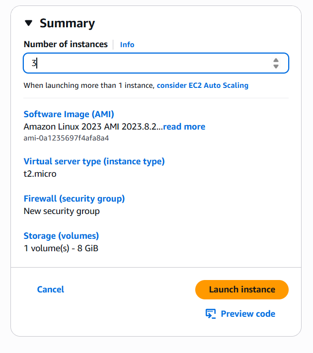

  

<h1 align="center" style="color:#2E86C1;">AWS EC2 - Load Balancing in EC2</h1>
 

<h3 align="left" style="color:#2E86C1;">📝 Introduction</h3>

---

This guide walks you through creating multiple **Linux server** on AWS EC2 using the AWS Management Console and applying load balancing on the server to distribute the incoming network traffic. Steps include launching the server, creating load balancer and viewing result.

 

<h3 align="left" style="color:#2E86C1;">🧭 Step-by-Step Instructions</h3>

---

### 📌 Step 1: Search EC2 and Click "Launch Instance"
- Go to the AWS Console
- Search for **EC2**
- Click on **"Launch Instance"**

  
   
  <i>Figure 1: Launch EC2 from AWS Console</i>

---

### 📌 Step 2: Provide a Name for Your Server
- Example name: `my-server`

  
   
  <i>Figure 2: Naming the EC2 instance</i>

---

### 📌 Step 3: Choose the Operating System
- Choose from:
  - ✅ Amazon Linux
  - ✅ Ubuntu
  - ✅ (Optional: Windows or Android)

  
   
  <i>Figure 3: Selecting an OS (e.g. Linux)</i>

---

### 📌 Step 4: Select Instance Type
- Use **t2.micro** (Free Tier eligible)
- Consider your app’s CPU, memory, and network needs

  
   
  <i>Figure 4: Selecting the instance type</i>

---

### 📌 Step 5: Configure Key Pair Login
- Select or create a **key pair**
- Download the `.pem` file for secure SSH access

  
   
  <i>Figure 5: Key pair setup for EC2 login</i>

---

### 📌 Step 6: Configure Network Settings
- Allow:
  - ✅ SSH (Port 22)
  - ✅ HTTP (Port 80)
  - ✅ HTTPS (Port 443)
- Click on **"Edit"**
- Click on **"Add security group rule"**
- Select **"All trafic"** in **"Type"**
- Select **"Anywhere"** in **"Source type"**

  
   
  
   
  <i>Figure 6: Opening ports in the security group</i>

---

### 📌 Step 7: Launch the Instance
- Enter the number of Instance you want
- Click **“Launch Instance”**
- Wait until the status is **"running"**

  
   
  <i>Figure 7: Launching the EC2 instance</i>

---

### 📌 Step 8: Connecting to server
- Select each server one by one and perform Step-8 to Step-10
- Click on **“Connect”**
- In the **"EC2 Instance Connect"** click on **"Connect"**

    
     
    
     
    <i>Figure 8: Connecting the EC2 instance</i>

---

### 📌 Step 9: Installing Packages
- Gain root access by `sudo su`
- Update server by `yum update -y`
- Install package by `yum install httpd -y`
- Activate package by `systemctl start httpd`

    
     
    
     
    <i>Figure 9: Installing packages on linux</i>

---

### 📌 Step 10: Hosting web page
- Navigate to **C-drive** by `cd /` 
- List all folders by `ls`
- Navigate to **"html"** folder by `cd var/www/html`
- Create an **"index.html"** file by `cat > index.html` 
- Write different content in different servers
- Press `Enter` and save your file by `Control + d`

    
     
    
     
    
     
    <i>Figure 10: Hosting the file</i>

---

### 📌 Step 11: Create Load balancer
- Click on **"Load Balancer"**
- Click on **"Create load Balancer"**
- In **"Application Load Balancer"** click on **"Create"**
- Give **"Load balancer"** name
- Select **"Internet-facing"** in **"Scheme"**
- Select multiple security groups (3 or 4)

    
     
    
     
    
     
    
     
    <i>Figure 11: Creating load balancer group</i>

---

### 📌 Step 12: Create target group
- In **"Listeners and routing"** click on **"Create target group"**
- Select **"Instance"** in **"target type"**
- Give the name of **"Target group"**
- Click on **"Next"**
- Select all the created instance and click on **"Include as pending below"**
- Click on **"Create target group"**

    
     
    
     
    
     
    
     
    
     
    
     
    <i>Figure 12: Creating target group</i>

---

### 📌 Step 13: Launch load balancer
- Click on the refresh icon
- Select your previous created target group
- Click on **"Create load balancer"**
- Wait until the **"Status"** shows **"Active"**

    
     
    
     
    
     
    <i>Figure 13: Launching load balancer</i>

---

### 📌 Step 14: Preview result
- Copy the **"DNS name** and open it in new tab
- Refresh the tab multiple times and the request will go to different servers each time

    
     
    
     
    
     
    <i>Figure 14: Showing results</i>

 

## 📚 Learnings

- Step-by-step EC2 setup
- Step-by-step creation of load balancer
- Step-by-step creation of target group

 

## 🔗 Resources

- [AWS Load Balancer Documentation](https://docs.aws.amazon.com/elasticloadbalancing/)
- [AWS Free Tier](https://aws.amazon.com/free)