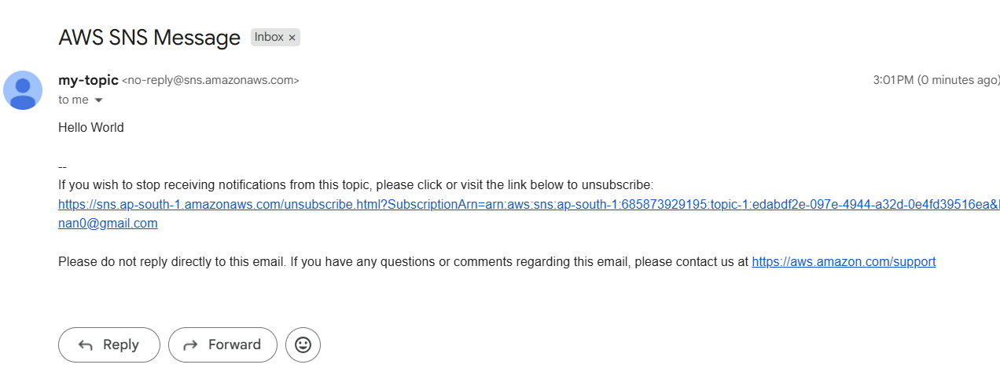

  

<h1 align="center" style="color:#2E86C1;">AWS SNS – Simple Notification Service Guide</h1>
 

<h3 align="left" style="color:#2E86C1;">📝 Introduction</h3>

---

**Amazon Simple Notification Service (SNS)** is a **fully managed messaging service** used to send:

- **SMS (Text Messages)**
- **Emails**
- **Push Notifications**
- **Messages to HTTP/HTTPS endpoints**
- **Messages to AWS Lambda functions or SQS queues**

It is commonly used for **alerts, notifications, and system-to-system messaging**.

---

<h3 align="left" style="color:#2E86C1;">📦 SNS Messaging Types</h3>

---

### ✅ **1️⃣ A2P – Application to Person**

- Sends **notifications from applications to people**  
- **Common Uses:**
  - SMS alerts  
  - Email notifications  
  - OTP verifications  
- **Example in this guide:** Sending SMS from AWS SNS to your mobile phone.

---

### ✅ **2️⃣ A2A – Application to Application**

- Sends **messages between systems or services**  
- **Common Uses:**
  - Triggering AWS Lambda  
  - Sending data to SQS queues  
  - Webhooks to HTTP/HTTPS endpoints  
- **Example Use Case:** Triggering an event-driven workflow in AWS.

---

### 🔍 **Summary Table**

| **Type** | **Purpose** | **Example** |
|----------|-------------|-------------|
| **A2P** | Notify people | SMS, Email |
| **A2A** | Notify applications | Lambda, SQS, HTTP |

---
 

<h3 align="left" style="color:#2E86C1;">🧭 Step-by-Step SNS Setup</h3>

---

### 📌 **Step 1: Open SNS in AWS Console**

- Go to **AWS Console**
- In the **search bar**, type **SNS** and select **Simple Notification Service**

    
     
    <i>Figure 1: SNS console</i>

---

### 📌 **Step 2: Create a Topic**

- Click on **Create Topic**
- **Select Topic Type:**  
  - **Standard** (For SMS & Email)  
  - **FIFO** (For strict message ordering – not used here)

#### **For this guide, select:**  
`Standard Topic`

- **Topic Name:** Example: `topic-1`  
- **Display Name (for SMS):** Example: `my-topic`

    
     
    
     
    <i>Figure 2: Topic Creation</i>

---

### 📌 **Step 3: Finalize Topic Creation**

- Skip optional settings or configure them as per need  
- Click **Create Topic**

    
     
    <i>Figure 3: Topic creation</i>

---

### 📌 **Step 4: Create a Subscription**

- Click on your created **Topic**
- Click on **Create Subscription**

#### **Subscription Settings:**

- **Topic ARN:** Auto-selected  
- **Protocol:** `Email`
- **Endpoint:** Enter the email address
- Click on **Create subscription**

    
     
    
     
    
     
    
     
    <i>Figure 4: Creating subscription</i>

---

### 📌 **Step 5: Verify Email Address**

Since AWS SNS requires verification:

- Open the mail received on the email address from AWS
- Click on **Confirm subscription**
- In **Subscription** section the **Status** will show as **Confirmed**

    
     
    
     
    <i>Figure 5: Verifying Email</i>

---

### 📌 **Step 6: Publish a Message**

- Go to your **SNS Topic**  
- Click on **Publish Message**
- Enter the **Subject**
- In **Message body** write your message
- Click on **Publish message**

    
     
    
     
    
     
    
     
    <i>Figure 6: Publishing message</i>

---

<h3 align="left" style="color:#2E86C1;">✅ Final Output</h3>

---

- Check your **Email**.  
- You will receive the **Email notification** from AWS SNS.

    
     
    <i>Figure 7: Result</i>

---

<h3 align="left" style="color:#2E86C1;">📚 Learnings</h3>

---

- Difference between **A2P and A2A messaging**  
- How to create a **Standard SNS Topic**  
- How to add **Email**  
- How to **send Email notifications** using SNS

---

## 🔗 Resources

- [AWS SNS Documentation](https://docs.aws.amazon.com/sns/latest/dg/welcome.html)  
- [AWS Free Tier](https://aws.amazon.com/free)
