

  

<h1 align="center" style="color:#2E86C1;">AWS SQS – Simple Queue Service Guide</h1>
 

<h3 align="left" style="color:#2E86C1;">📝 Introduction</h3>

---

**Amazon SQS (Simple Queue Service)** is a **fully managed message queuing service** that helps decouple components of distributed systems.

### ✅ **Why Use SQS?**

- Store and manage **messages between services**  
- Handle **asynchronous communication**  
- Prevent **message loss and duplication**  
- **Scales automatically**

---

<h3 align="left" style="color:#2E86C1;">📦 SQS Types</h3>

---

### **1️⃣ Standard Queue**

- **High throughput**  
- **At-least-once delivery**  
- **Possible duplicates**  
- **Best-effort ordering**

### **2️⃣ FIFO Queue (First-In-First-Out)**

- **Exact message ordering**  
- **Exactly-once delivery**  
- **Limited throughput compared to Standard**

---
 
<h3 align="left" style="color:#2E86C1;">🧭 Step-by-Step SQS Setup</h3>

---

### 📌 **Step 1: Open SQS in AWS Console**

- Go to **AWS Console**  
- Search for **SQS** in the search bar  
- Click **Create Queue**

    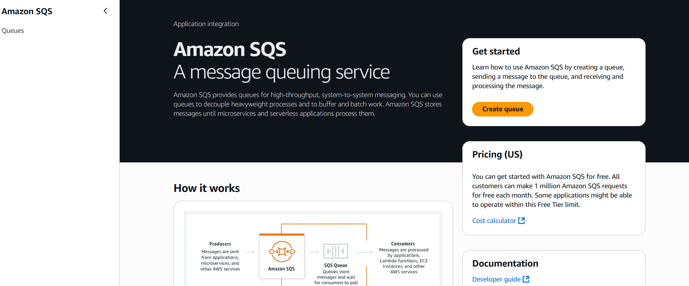
     

---

### 📌 **Step 2: Configure Queue**

- **Type:**  
  - **Standard** or **FIFO** (choose based on requirement)

#### **Queue Settings:**

- **Queue Name:** Example: `my-queue.fifo`  
- **Configuration:** Leave default or adjust as needed  
- **Encryption:** No changes required (default AES256)  
- **Access Policy:** Only queue owner can access  
- **Retrieval Policy:** Disabled  
- **Dead Letter Queue:** Disabled (optional)
- Click on **Create queue**

  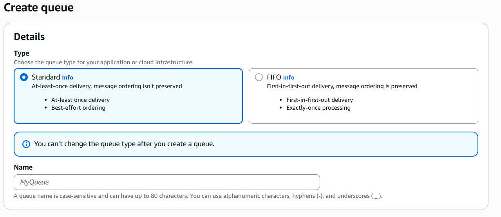
   
  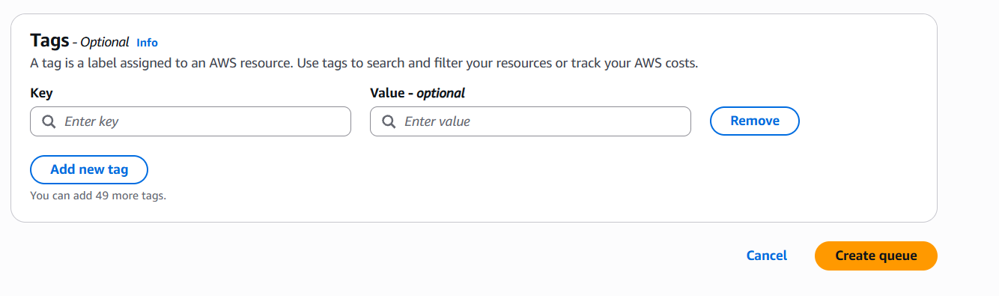
   

---

### 📌 **Step 3: Create SNS Topic**

- Go to **SNS Dashboard**  
- Click **Create Topic**  
- **Type:** FIFO  
- **Name:** Example: `my-sns-topic.fifo`
- Click **Create topic**

    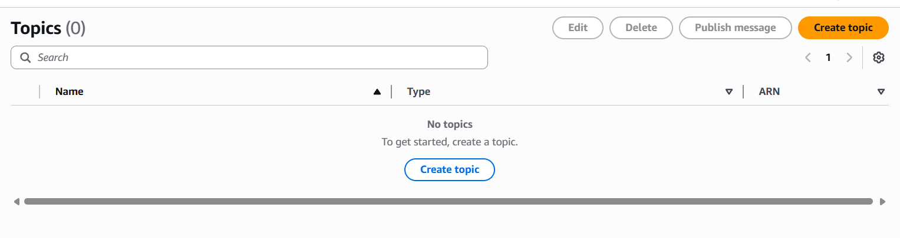
     
    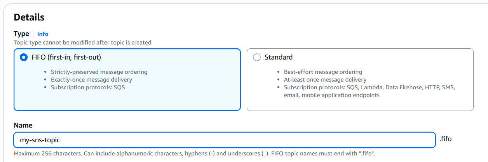
     
    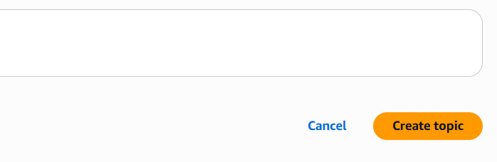
     
    <i>Figure 1: SNS console</i>

---

### 📌 **Step 4: Create Subscription**

- **Protocol:** `SQS`  
- **Endpoint:** Select the **SQS Queue** you just created  
- Click **Create Subscription**

    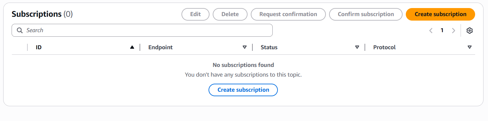
     
    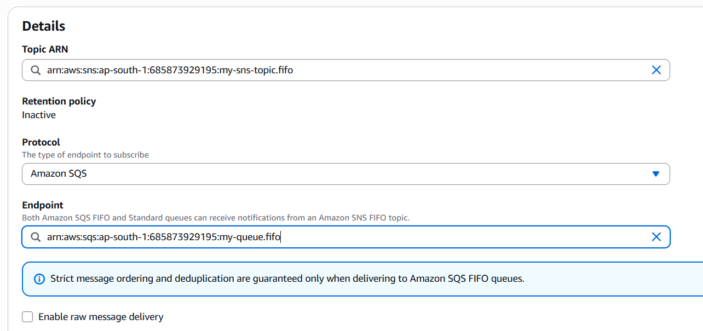
     
    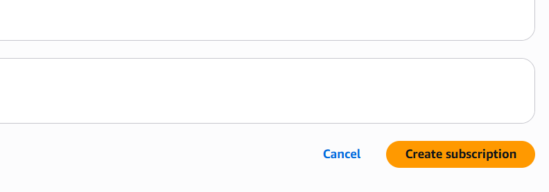
     

---

### 📌 **Step 5: Publish a Message from SNS**

- Go to **SNS Topics**  
- Select your **FIFO topic**  
- Click **Publish Message**

#### **Fill the form:**

- **Subject:** Example: `AWS SQS Message`  
- **Message Group ID:** (Required for FIFO) – Example: `101`  
- **Deduplication ID:** (Optional, or auto-generated) - Example: `102`
- **Time To Live (TTL):**  
  - The **lifetime of a message in seconds**  
  - If TTL expires, the message will not be delivered  
- **Message Body:** Your message content
- Click **Publish message**

    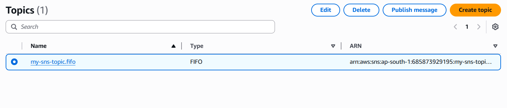
     
    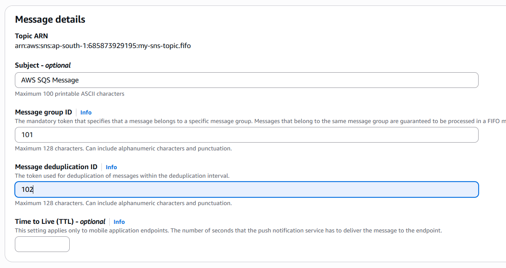
     
    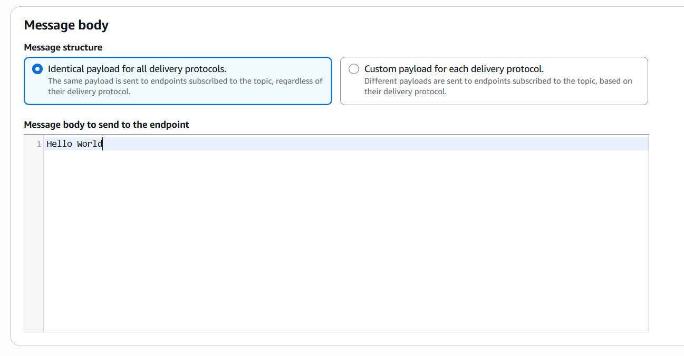
     
    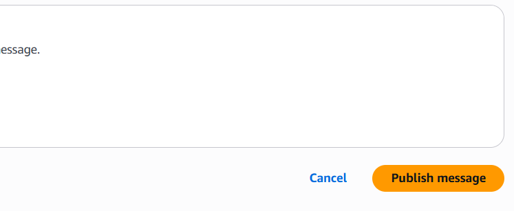
     

---

### 📌 **Step 6: Check Messages in SQS**

- Go to your **SQS Queue**  
- You will see the **Message Available count increase**

    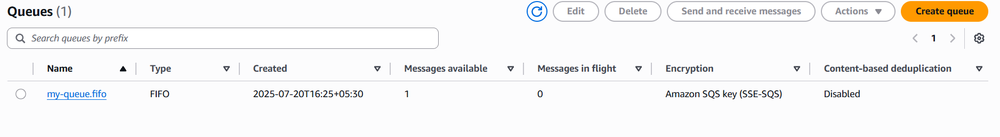
     

---

### 🔄 **Test Multiple Messages**

- **Publish multiple messages** (2-3 times)  
- Check the **message count** in your SQS Queue.  
- Each message will be stored in the queue for consumers to process.

    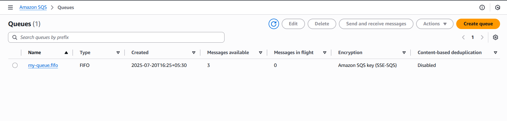
     

---

<h3 align="left" style="color:#2E86C1;">📚 Learnings</h3>

---

- How to create **FIFO and Standard Queues**  
- How to connect **SNS to SQS**  
- How to **send and retrieve messages from SQS**  
- How **Time To Live (TTL)** works in message handling

---

## 🔗 Resources

- [AWS SQS Documentation](https://docs.aws.amazon.com/AWSSimpleQueueService/latest/SQSDeveloperGuide/welcome.html)  
- [AWS Free Tier](https://aws.amazon.com/free)
